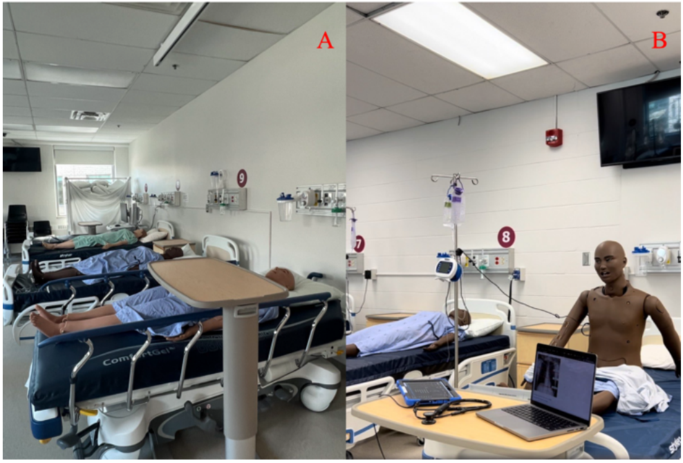
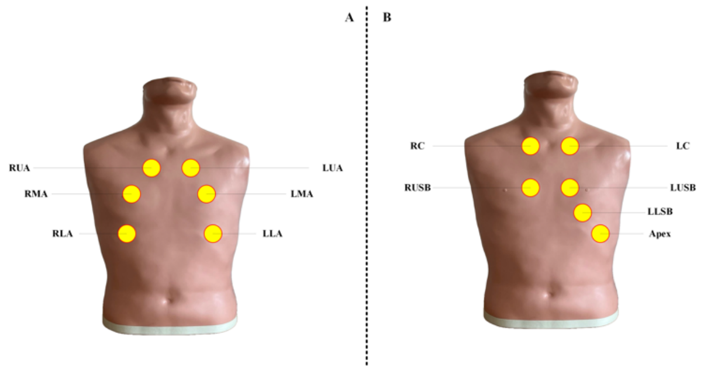

## Dataset Paper

**Copyright:** © 2024 by the authors. Distributed under the Creative Commons Attribution (CC BY) license.

### Manikin-Recorded Cardiopulmonary Sounds Dataset Using Digital Stethoscope

**Authors:**  
Yasaman Torabi1, Shahram Shirani1,2, James P. Reilly1  
1Electrical and Computer Engineering, McMaster University, Hamilton, Ontario, Canada  
2L.R. Wilson/Bell Canada Chair in Data Communications, Hamilton, Ontario, Canada  
**Contact:** Yasaman Torabi (torabiy@mcmaster.ca)

#### Abstract

This dataset contains heart and lung sounds recorded from a clinical manikin using a digital stethoscope. It includes both individual and mixed cardiorespiratory recordings, covering normal and abnormal sounds (e.g., murmurs, atrial fibrillation, tachycardia, AV block, S3/S4, wheezing, crackles, rhonchi, pleural rub, gurgling). Recordings were made at multiple anatomical chest locations, as determined by specialist nurses, and enhanced with frequency filters. The dataset supports AI research in automated disease detection, sound classification, source separation, and deep learning for audio signal processing.

- **Data Type:** Audio (.wav)
- **DOI:** [10.17632/8972jxbpmp.1](https://doi.org/10.17632/8972jxbpmp.1)
- **Keywords:** AI, Cardiorespiratory Sounds, Deep Learning, Signal Processing, Digital Stethoscope, Heart Sound, Lung Sound

#### Background

Cardiopulmonary diseases are a leading cause of mortality. Accurate auscultation is essential for diagnosis, and digital stethoscopes combined with AI enable improved analysis and sharing of these sounds. High-quality, diverse datasets are needed for effective model training. Patient simulators, like the manikin used here, provide a realistic and risk-free environment for data collection.

#### Data Collection

- **Environment:** Controlled, noise-free, manikin in sitting position
- **Manikin:** CAE Juno™, controlled via CAE Maestro software
- **Device:** 3M™ Littmann® CORE Digital Stethoscope (Bell, Diaphragm, Midrange modes)
- **Recording:** 15 seconds per file, .wav format, uploaded to cloud
- **Processing:** Time-domain and spectrogram visualizations

#### Validation

- Recordings validated by a nursing team
- Controlled environment and high-quality stethoscope
- Regularly maintained and calibrated manikin

#### Dataset Overview

- **Total Files:** 210 audio files (101 female, 109 male)
- **Categories:** 50 heart (HS.zip), 50 lung (LS.zip), 110 mixed (Mix.zip)
- **Metadata:** CSV files with file name, gender, sound type, anatomical location
- **Naming:** `Gender_SoundType_Location.wav` (e.g., `F_LSM_R_LUSB.wav`)
- **Sound Types:** 10 heart, 6 lung
- **Auscultation Sites:** 12 chest locations

#### Notebook Exploration (`heart_lung_sound_exploration.ipynb`)

A Jupyter notebook is provided for initial data exploration and analysis. It demonstrates:
- Loading metadata from the CSV files (`HS.csv`, `LS.csv`, `Mix.csv`).
- Visualizing audio waveforms and spectrograms for heart, lung, and mixed sounds.
- Displaying distributions of sound types, genders, and anatomical locations across the datasets.
- Basic sound separation techniques using filtering (Butterworth), spectrogram masking, and wavelet transforms (DWT).

**Sound Type Abbreviations:**

*   **Heart Sound Types:**
    *   NH: Normal Heart
    *   LDM: Late Diastolic Murmur
    *   MSM: Mid Systolic Murmur
    *   LSM: Late Systolic Murmur
    *   AF: Atrial Fibrillation
    *   S4: Fourth Heart Sound
    *   ESM: Early Systolic Murmur
    *   S3: Third Heart Sound
    *   T: Tachycardia
    *   AVB: Atrioventricular Block
*   **Lung Sound Types:**
    *   NL: Normal Lung
    *   W: Wheezing
    *   C: Crackles (referred to as CC and FC in filenames/metadata)
    *   R: Rhonchi
    *   PR: Pleural Rub
    *   G: Gurgling (Not explicitly listed in notebook analysis but present in dataset description)

#### Source Code

Python scripts: [github.com/Torabiy/HLS-CMDS](https://github.com/Torabiy/HLS-CMDS)

#### Dataset Collection Points

Recordings were made from various chest locations for heart, lung, and mixed sounds (see Fig. 2). Lung recordings were performed on both sides of the chest, each divided into upper, middle, and lower zones. The anterior chest was prioritized for optimal sound quality.

**FIGURE 2.** Setup and Environment: (A) Recording unit at Professional Practice Collaboratory (PPC), and (B) Manikin in a sitting position alongside the recording setup.

**FIGURE 2.** Chest zone landmarks for recording: (A) lung sounds, (B) heart sounds.

**Lung Auscultation Landmarks (see Figure 2A):**
- **RUA (Right Upper Anterior):** 2nd–4th ribs, right side
- **RMA (Right Middle Anterior):** 4th–6th ribs, right side
- **RLA (Right Lower Anterior):** 6th–8th ribs, right side, angled 45° down from nipple
- **LUA (Left Upper Anterior):** 2nd–4th ribs, left side
- **LMA (Left Middle Anterior):** 4th–6th ribs, left side
- **LLA (Left Lower Anterior):** 6th–8th ribs, left side, angled 45° down from nipple

**Heart Auscultation Sites (see Figure 2B):**
- **Apex:** Mitral area (left 5th intercostal space, midclavicular line)
- **RUSB (Right Upper Sternal Border):** Aortic area (right 2nd intercostal space)
- **LUSB (Left Upper Sternal Border):** Pulmonary area (left 2nd intercostal space)
- **LLSB (Left Lower Sternal Border):** Tricuspid area (left 4th intercostal space)
- **RC (Right Costal Margin):** Right lower chest margin
- **LC (Left Costal Margin):** Left lower chest margin

#### References

See the original paper or dataset documentation for references.